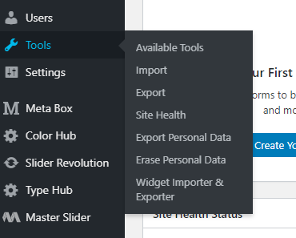

We had a wordpress multi-site installation that was working just fine! However custom domain and SSL pose a clear problem, along with any specific changes one might have to make to the installation.

NO CODE! NO SQL!

So I decided to move back to regular wordpress. Now we are using the popular exponent theme, the challenge is that we are using a default demo setup which is modified. The goal was to make an easy shift, not make it into a week long project ;).

Here are the simple steps to making this happen

Download the backup XML from the wordpress multisite installation
Tools>Export

Now you have an XML! This contains all the information that you need. All the next steps are on the new wordpress instance.
Say you install a new server with only wordpress, the first thing you need to do is install the same theme and then load the exact same demo installation.
This next step requires you deleting all the headers/footers (tatsu plugin) /posts/menus. Now the stage is set!
You will next have to import the XML file into the setup.
Tools>Import
You can choose the default user to own all the files!
And you are done!
Well not yet ;). You will have to get all the images from the older installation into the media folder here. That maybe a bit tedious.
Now that was fun! Happy importing.